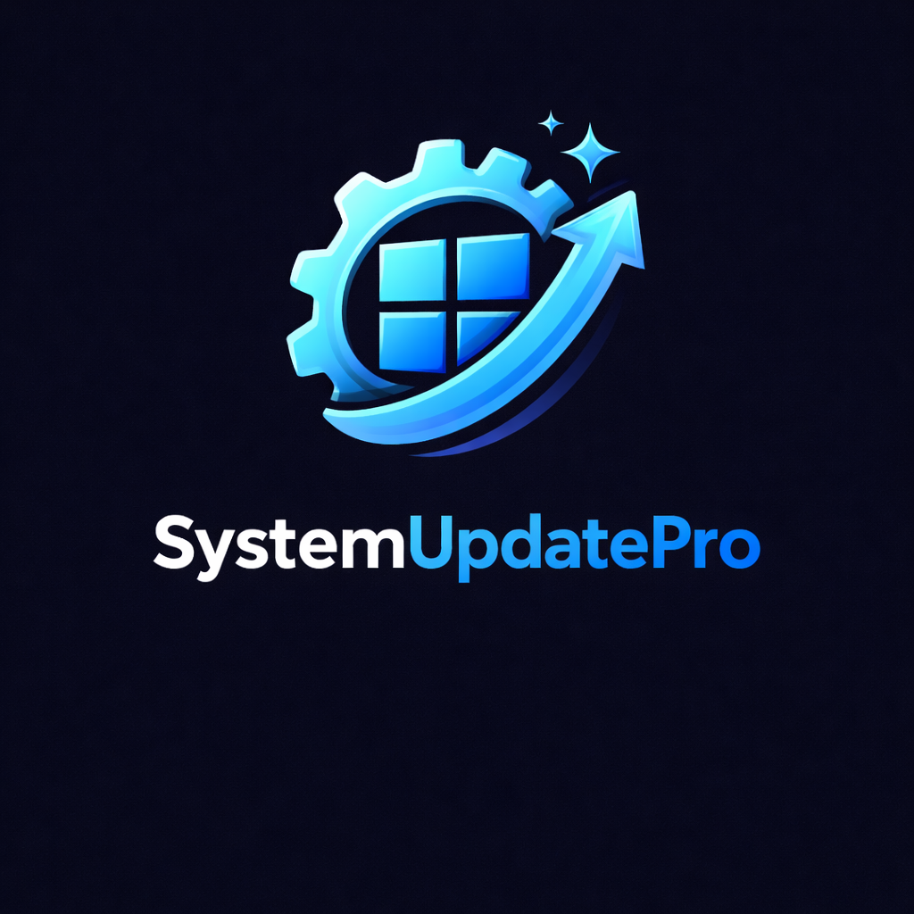

<p align="center"></p>

# SystemUpdatePro

<p align="center">
  
  
  
  
</p>

**Enterprise-grade, bulletproof system update utility for MSPs and IT professionals.**

SystemUpdatePro is a fully automated, self-healing PowerShell script that handles OEM driver/BIOS updates (Dell, Lenovo, HP), Windows Updates, and application updates via Winget---all without user interaction.

---

## Features

### Multi-OEM Support
| Manufacturer | Tool Used | Auto-Install |
|--------------|-----------|--------------|
| Dell / Alienware | Dell Command Update CLI 5.7.0+ | Exact WinGet package + publisher verification |
| Lenovo | LSUClient PowerShell Module 1.8.1 | Exact SHA-256 package |
| HP | HP Image Assistant 5.3.3+ | SHA-256 + HP publisher verification |
| Other | Windows Update + Winget only | N/A |

### Self-Healing Capabilities
- **WinGet Auto-Install**: Installs the pinned Microsoft App Installer bundle with its signed, architecture-specific dependencies
- **Windows Update Repair**: Diagnoses WUA first, then uses journaled service changes and reversible run-scoped cache swaps only when repair is needed
- **Service Recovery**: Detects and repairs broken OEM services
- **Retry Logic**: Exponential backoff with configurable retry attempts

### Safety Features
- **Lock File**: Prevents concurrent execution with stale lock detection
- **Disk Space Check**: Blocks execution if insufficient space available
- **Fail-Closed Firmware Safety**: Requires a verified OEM/model scan, free space, AC power, at least 50% charge, and known BitLocker state
- **BitLocker Awareness**: Dell uses its documented automatic suspension path; Lenovo/HP firmware waits until protection is already suspended or disabled
- **Pending Reboot Detection**: Checks 5 different sources for pending reboots
- **DryRun Mode**: Preview all available updates without installing anything
- **Driver Backup**: Export current drivers before installing updates for rollback capability
- **Verified Dependencies**: Restricts downloads and redirects to approved HTTPS origins, checks hashes and publishers before execution, enforces safe version floors, and never changes PowerShell Gallery trust
- **Capability Matrix**: Gates each provider by Windows build/edition, Server/Core, architecture, PowerShell runtime, execution context, and verified provider version
- **Privileged Mutation Recovery**: Atomically journals exact registry, service, cache, and scheduled-task before-images; startup rolls back interrupted runs before allowing new changes
- **Protected Evidence Store**: Uses write-through atomic replacement, last-known-good recovery, corrupt-file quarantine, verified SYSTEM/Administrators ACLs, and configurable secret/serial redaction
- **Diagnostic Bundle**: Produces one bounded, hash-manifested, fully redacted archive of the latest run, provider output, Windows servicing evidence, and recovery status
- **Validated Inputs and Secret References**: Rejects unsafe ranges, paths, and endpoints before initialization; webhook secrets resolve from environment or protected-file references instead of process arguments

### Enterprise Integration
- **Event Log**: Writes to Windows Application log for RMM/SIEM visibility
- **Exit Codes**: Granular exit codes for automation pipelines
- **WSUS Bypass**: Option to bypass WSUS and connect directly to Microsoft
- **Post-Reboot Continuation**: Versioned, bounded state machine resumes update stages with the original run settings
- **Evidence Retention**: Applies age and total-size limits across logs, transcripts, reports, OEM output, quarantine files, and driver backups
- **HTML Reports**: Responsive operations-dashboard report with update channels, dependency provenance, retention evidence, device profile, exceptions, and print styles
- **Webhook Notifications**: Send a versioned, idempotent completion contract to Slack, Teams Workflows/Adaptive Cards, legacy Teams connectors, or a generic HTTPS endpoint with durable retry evidence
- **Update History**: Schema-versioned JSON history with stage/item outcomes, provider codes, platform/provider capabilities, dependency provenance, and evidence-delivery status

---

## Requirements

- **OS baseline**: Windows build 14393 or later; provider-specific limits are enforced before each operation
- **PowerShell**: Windows PowerShell 5.1 or PowerShell 7
- **Privileges**: Administrator user or `NT AUTHORITY\SYSTEM`
- **Network**: Access to the enabled providers' approved origins

### Automated capability contract

These combinations are exercised by the PowerShell 5.1 and PowerShell 7 Pester suite. They are capability boundaries, not a claim that every OEM model is supported; the signed OEM tool must still complete an applicability scan for the detected model.

| Platform | Windows Update / servicing | WinGet CLI | OEM adapters |
|----------|----------------------------|------------|--------------|
| Windows 10 build 14393-17762 | Enabled | Skipped: requires build 17763+ | Dell/Lenovo on x64 when applicable; HPIA requires build 17763+ |
| Windows 10 build 17763+ / Windows 11 | Enabled | Administrator-user context only | Dell/Lenovo on x64; HPIA on x64/ARM64; matching manufacturer required |
| Server 2016/2019/2022, Desktop or Core | Enabled | Skipped | Skipped |
| Server 2025 Desktop Experience | Enabled | Administrator-user context only | Skipped |
| Server 2025 Core | Enabled | Skipped | Skipped |

Windows Update and inbox servicing accept x86, x64, and ARM64. The WinGet CLI matrix accepts x86, x64, and ARM64 but intentionally blocks `SYSTEM`, where the CLI cannot reliably enumerate user-scoped packages. Dell may run an already verified 5.7.0+ CLI under `SYSTEM`, but its WinGet bootstrap requires an administrator-user context. Missing or stale Lenovo and HP tooling is replaced from the pinned manifest before use.

---

## Installation

### Option 1: Direct Download
```powershell
# Download the script
Invoke-WebRequest -Uri "https://raw.githubusercontent.com/SysAdminDoc/SystemUpdatePro/main/SystemUpdatePro.ps1" -OutFile "SystemUpdatePro.ps1"

# Run it
.\SystemUpdatePro.ps1
```

### Option 2: Clone Repository
```powershell
git clone https://github.com/SysAdminDoc/SystemUpdatePro.git
cd SystemUpdatePro
.\SystemUpdatePro.ps1
```

---

## Usage

### Basic Usage
```powershell
# Full update: OEM drivers + Windows Updates + Winget upgrades
.\SystemUpdatePro.ps1

# Include BIOS updates with auto-reboot
.\SystemUpdatePro.ps1 -IncludeBIOS -Reboot

# Windows Updates only
.\SystemUpdatePro.ps1 -SkipOEM -SkipWinget

# OEM updates only
.\SystemUpdatePro.ps1 -SkipWindows -SkipWinget
```

### Dry Run (Preview Mode)
```powershell
# See what updates are available without installing anything
.\SystemUpdatePro.ps1 -DryRun

# Dry run with BIOS check included
.\SystemUpdatePro.ps1 -DryRun -IncludeBIOS
```

### Driver Backup
```powershell
# Backup drivers before updating
.\SystemUpdatePro.ps1 -BackupDrivers

# Backup drivers + include BIOS updates
.\SystemUpdatePro.ps1 -BackupDrivers -IncludeBIOS -Reboot
```

### Webhook Notifications
```powershell
# Have the RMM inject its protected secret into this process environment variable
.\SystemUpdatePro.ps1 -WebhookSecretReference "env:SYSTEMUPDATEPRO_WEBHOOK_URL"

# Or resolve an endpoint from a protected schema-versioned config
.\SystemUpdatePro.ps1 -WebhookSecretReference "file:C:\ProgramData\SystemUpdatePro\webhook.json"
```

Raw webhook URLs are intentionally not accepted as parameters because command-line arguments are visible to process inventory and RMM tooling. Environment values may come from an RMM secret variable. A file reference must point to a SYSTEM/Administrators-only JSON file:

```json
{
  "schema_version": 1,
  "webhook_url": "https://your-provider.example/webhook-secret"
}
```

Provision that file through the same privileged configuration-management channel used to deploy the script. The endpoint must be absolute HTTPS, must not contain URI user information or a fragment, and is registered for redaction before logging or transcript startup.

### Update History
```powershell
# Show last 10 update runs
.\SystemUpdatePro.ps1 -ShowHistory

# Show last 25 update runs
.\SystemUpdatePro.ps1 -ShowHistory -HistoryCount 25
```

### Diagnostic and Recovery Bundle
```powershell
# After a failed or completed run, collect support evidence without running updates
.\SystemUpdatePro.ps1 -CreateDiagnosticBundle

# Apply a smaller hard ceiling to the generated ZIP
.\SystemUpdatePro.ps1 -CreateDiagnosticBundle -DiagnosticBundleMaxSizeMB 25
```

The standalone command requires administrator privileges, prints the completed archive path, and exits without acquiring the update lock or running any update stage.

### Advanced Usage
```powershell
# Full provisioning workflow with post-reboot continuation
.\SystemUpdatePro.ps1 -IncludeBIOS -Reboot -ContinueAfterReboot -CleanupAfter

# Repair broken Windows Update then run updates
.\SystemUpdatePro.ps1 -RepairWindowsUpdate -BypassWSUS

# Irreversibly remove superseded component versions (prevents update uninstall)
.\SystemUpdatePro.ps1 -ResetComponentBase

# Force non-firmware work despite low disk or a pending reboot (firmware safeguards remain enforced)
.\SystemUpdatePro.ps1 -Force -SkipOEM

# Custom configuration
.\SystemUpdatePro.ps1 -MaxRetries 5 -MaxUpdatePasses 5 -MinDiskSpaceGB 20 -LogRetentionDays 60 -EvidenceMaxSizeMB 1024

# Kitchen sink: backup drivers, dry run with an RMM-provided webhook secret
.\SystemUpdatePro.ps1 -DryRun -BackupDrivers -WebhookSecretReference "env:SYSTEMUPDATEPRO_WEBHOOK_URL"
```

---

## Parameters

| Parameter | Type | Default | Description |
|-----------|------|---------|-------------|
| `-SkipOEM` | Switch | False | Skip OEM-specific driver/firmware updates |
| `-SkipWindows` | Switch | False | Skip Windows Update |
| `-SkipWinget` | Switch | False | Skip Winget upgrade all |
| `-IncludeBIOS` | Switch | False | Include BIOS/firmware only after OEM/model, tool, disk, power, charge, and BitLocker checks are known-ready |
| `-BypassWSUS` | Switch | False | Bypass WSUS, connect directly to Microsoft |
| `-RepairWindowsUpdate` | Switch | False | Repair Windows Update components before updating |
| `-CleanupAfter` | Switch | False | Run standard DISM cleanup while retaining installed-update rollback |
| `-ResetComponentBase` | Switch | False | Run irreversible `/ResetBase`; installed Windows updates can no longer be uninstalled |
| `-ContinueAfterReboot` | Switch | False | Resume update stages after reboot with the original run settings (maximum 3 attempts) |
| `-DryRun` | Switch | False | Preview updates without installing |
| `-BackupDrivers` | Switch | False | Export current drivers before updating |
| `-ShowHistory` | Switch | False | Display previous update run history |
| `-WebhookSecretReference` | String | (none) | `env:VARIABLE_NAME` or `file:C:\path\config.json`; the resolved value must be HTTPS |
| `-HistoryCount` | Int | 10 | Number of history entries to show (1-100) |
| `-MaxRetries` | Int | 3 | Maximum attempts for retryable operations and webhook delivery (1-10) |
| `-MaxUpdatePasses` | Int | 3 | Maximum Windows Update passes (1-10) |
| `-MinDiskSpaceGB` | Int | 10 | Minimum free disk space required (1-1024 GB) |
| `-MinFirmwareChargePercent` | Int | 50 | Minimum battery charge for firmware (10-100) |
| `-LogPath` | String | C:\ProgramData\SystemUpdatePro\Logs | Dedicated absolute local log directory |
| `-LogRetentionDays` | Int | 30 | Days to retain owned evidence artifacts (1-3650) |
| `-EvidenceMaxSizeMB` | Int | 512 | Maximum combined size of retained evidence (10-10240 MB) |
| `-RedactionMode` | Enum | SecretsAndSerials | `Secrets` or `SecretsAndSerials` for persisted evidence |
| `-CreateDiagnosticBundle` | Switch | False | Create a diagnostic/recovery ZIP from the latest local evidence, then exit |
| `-DiagnosticBundleMaxSizeMB` | Int | 50 | Hard archive-size ceiling (5-512 MB) |
| `-Reboot` | Switch | False | Allow automatic reboot if required |
| `-Force` | Switch | False | Continue non-firmware work despite low disk or pending reboot; never overrides unknown/blocked firmware safety |

`-CleanupAfter` never uses `/ResetBase`. The separate `-ResetComponentBase` switch is intentionally high risk and also requests cleanup, so it does not need to be combined with `-CleanupAfter`. Use `-DryRun -ResetComponentBase` to preview the exact DISM command and rollback impact. Temporary Disk Cleanup `StateFlags0100` registry values are restored after each run, and restoration or `cleanmgr` failures are reported as partial cleanup.

Firmware is excluded by default. With `-IncludeBIOS`, Dell Command Update, LSUClient, or HP Image Assistant must first complete an applicability scan for the detected model. Disk, AC, charge, or BitLocker query failures remain `Unknown` and block firmware even with `-Force`; non-firmware OEM updates may continue. Active BitLocker is accepted only for Dell's documented `-autoSuspendBitLocker=enable` path. Lenovo and HP require protection to be suspended beforehand.

Elevated dependencies are defined in one in-script acquisition manifest. WinGet 1.29.280, PSWindowsUpdate 2.2.1.5, LSUClient 1.8.1, Dell Command Update 5.7.0, and HPIA 5.3.6 are pinned to their approved origins and digests. A valid newer installed WinGet, Dell CLI, or HP Image Assistant is accepted only when it meets the recorded minimum and publisher contract. Dell update execution also requires a signed Inventory Collector 13.8.0 or later. PowerShell modules are loaded by their verified versioned manifest path, so an unverified higher version cannot take precedence.

Preflight records the capability schema, OS build/edition, installation type, architecture, PowerShell runtime, execution context, and each provider's detected/minimum/acquisition version. Unsupported providers are skipped with a machine-readable reason rather than invoked optimistically. The same assessment is preserved across reboot continuation and included in history, generic webhook payloads, and HTML run details.

---

## Exit Codes

| Code | Description |
|------|-------------|
| 0 | Success, no reboot needed |
| 1 | Success, reboot required |
| 2 | Partial success (some updates failed) |
| 3 | Critical failure |
| 4 | Insufficient disk space |
| 5 | Pending reboot blocked execution |
| 6 | Already running (lock file exists) |
| 7 | Firmware safety prerequisites blocked or unknown |

---

## Event Log Integration

SystemUpdatePro writes to the Windows Application event log under source **"SystemUpdatePro"**:

| Event ID | Meaning |
|----------|---------|
| 1000 | Success, no reboot needed |
| 1001 | Success, reboot required |
| 1002 | Partial success |
| 1003 | Critical failure |
| 1004 | Insufficient disk space |
| 1005 | Pending reboot blocked |
| 1006 | Already running |
| 1007 | Firmware safety blocked |

### Query Events via PowerShell
```powershell
Get-EventLog -LogName Application -Source "SystemUpdatePro" -Newest 10
```

---

## File Locations

| Path | Purpose |
|------|---------|
| `C:\ProgramData\SystemUpdatePro\Logs\` | Logs, transcripts, HTML reports, and OEM command output |
| `C:\ProgramData\SystemUpdatePro\update.lock` | Lock file (prevents concurrent runs) |
| `C:\ProgramData\SystemUpdatePro\state.json` | Protected, versioned post-reboot continuation state |
| `C:\ProgramData\SystemUpdatePro\Journals\` | Protected, run-scoped privileged-mutation recovery journals |
| `C:\ProgramData\SystemUpdatePro\update_history.json` | Update history log (last 100 runs) |
| `C:\ProgramData\SystemUpdatePro\DriverBackups\` | Driver backup snapshots (last 3 kept) |
| `C:\ProgramData\SystemUpdatePro\Bundles\` | Protected diagnostic/recovery ZIP archives |
| `C:\ProgramData\SystemUpdatePro\WebhookDeliveries\` | Atomic per-run webhook attempt and terminal-status records |
| `C:\ProgramData\SystemUpdatePro\webhook.json` | Optional operator-provisioned webhook config (SYSTEM/Administrators ACL required) |
| `C:\ProgramData\SystemUpdatePro\HPIA\` | HP Image Assistant installation |

Continuation state is atomically replaced and restricted to SYSTEM and Administrators. It preserves the run ID, effective parameters, result history, attempt count, next stage cursor, webhook reference, and resolved endpoint needed after reboot; task command lines contain only the script path. Schema v3/v4 state migrates to v5 with explicit evidence-policy and secret-source defaults. Invalid, incompatible, or broadly writable state is quarantined instead of being executed. A continuation can resume at most three times, and terminal success or failure removes its one-shot task and active state.

Privileged mutations use a separate atomic journal with the same protected access model. WSUS policy, service status/startup mode, cleanmgr flags, update-cache directory swaps, and continuation-task replacement are verified and restored in reverse order. An interrupted journal is recovered before a new run can mutate the machine; recovery failure stops the run.

All script-owned local evidence uses write-through temporary files and atomic replacement where the format permits it. Structured files are parsed and schema-validated before promotion; a protected `.previous` copy is restored when the primary is corrupt, and invalid inputs are moved to timestamped quarantine files. Legacy history arrays migrate to the v2 history envelope. Operator-facing evidence always redacts secret-bearing URL/query/header values, and device serials are also redacted by default; use `-RedactionMode Secrets` only when serial retention is operationally required. Active continuation state retains the original webhook endpoint under its private ACL so delivery can resume, then terminal cleanup removes it.

Retention runs at startup and after driver export. It removes only recognized SystemUpdatePro artifacts older than `-LogRetentionDays`, including diagnostic bundles and webhook-delivery records, then removes the oldest remaining artifacts until their combined size is at most `-EvidenceMaxSizeMB`; active run files and live state/history recovery copies are excluded. Driver backups remain additionally capped at three. Reports and machine-readable results record exact file/directory counts, bytes freed, remaining bytes, and cleanup errors.

---

## Diagnostic Bundle

`-CreateDiagnosticBundle` is a best-effort recovery command: an unavailable event channel or failed `Get-WindowsUpdateLog` conversion is recorded in `manifest.json` and does not discard the rest of the archive. Each ZIP contains:

- Schema-versioned `manifest.json` with SHA-256, included/original byte counts, truncation flags, omissions, and collector errors
- Latest validated run result, effective policy, and any active continuation state
- Current OS/PowerShell/provider versions, capability assessment, and dependency provenance
- Recent protected run logs, transcripts, HTML report, webhook delivery records, Dell logs, and HP Image Assistant output
- Seven days of bounded Windows Update Client, Update Orchestrator, and System events; reconstructed Windows Update output; and bounded CBS, DISM, and reporting-log tails when available
- Mutation-journal status plus the latest verified recovery actions

Archives are published atomically under the same SYSTEM/Administrators-only ACL as other evidence and never exceed `-DiagnosticBundleMaxSizeMB`. Bundle creation always redacts secrets and serial numbers, even when ordinary local evidence uses `-RedactionMode Secrets`. Source logs are tail-truncated before packaging when necessary, and temporary staging data is removed after success or failure.

---

## HTML Reports

After each run, SystemUpdatePro generates a responsive, self-contained operations report with:
- A decisive run-status summary and at-a-glance update metrics
- OEM, Windows Update, and Winget channel breakdowns
- A compact device inventory profile
- Dedicated exceptions and follow-up guidance
- Audit-friendly run metadata and log location
- Evidence-retention deletion counts and remaining footprint
- Responsive layouts for desktop and mobile plus print-optimized styles
- HTML-encoded machine and update data for safe rendering

Reports are saved to the log directory and automatically open in your browser (unless running as SYSTEM or non-interactively).

---

## Webhook Payload

When using `-WebhookSecretReference`, the resolved endpoint receives the following JSON payload:

```json
{
  "schema_version": 2,
  "event_type": "system_update.completed",
  "run_id": "c59c67f1-2f28-45a2-b8de-14872cc4973e",
  "idempotency_key": "b2b8e9558efee1a3e5e362be2f28cb7880d940462774009c4618c5f91b2bb0d6",
  "started_at": "2026-07-29T19:00:00.0000000-04:00",
  "completed_at": "2026-07-29T19:03:00.0000000-04:00",
  "hostname": "PCNAME",
  "status": "success|partial|failed",
  "dry_run": false,
  "evidence_uri": "file:///C:/ProgramData/SystemUpdatePro/Logs/SystemUpdatePro_Report_20260729_190300.html",
  "oem_updates": 3,
  "windows_updates": 5,
  "winget_updates": 12,
  "total_installed": 20,
  "total_available": 20,
  "total_failed": 0,
  "reboot_required": true,
  "exit_code": 1,
  "errors": [],
  "warnings": [],
  "runtime_seconds": 180,
  "stage_summary": [
    {
      "name": "WindowsUpdate",
      "provider": "Windows Update",
      "status": "Succeeded",
      "attempted": 5,
      "available": 5,
      "installed": 5,
      "failed": 0,
      "skipped": 0,
      "provider_exit_code": 2,
      "reboot_required": true
    }
  ]
}
```

Generic endpoints receive the full v2 JSON contract. Slack receives a compact correlated message. A `*.logic.azure.com/workflows/...` endpoint receives a Teams Workflow Adaptive Card generated from the same contract; legacy `webhook.office.com` and `outlook.office.com` connectors retain MessageCard compatibility for migration only.

Every request carries `Idempotency-Key` and `X-SystemUpdatePro-Run-Id` headers. HTTP 408/425/429/5xx and transport failures retry up to `-MaxRetries` total attempts. The default exponential delays are 2, 4, 8… seconds; a valid `Retry-After` delta or date takes precedence, with every delay capped at 60 seconds. Redirects are refused so a credential-bearing endpoint cannot be forwarded to another origin.

Each attempt is atomically saved to `WebhookDeliveries\<run-id>.json` before a retry delay, and the final record contains `Succeeded`, `Failed`, or `Rejected` terminal status. The same attempt array, idempotency key, channel, evidence URI, and local-record status are embedded in update history and diagnostic bundles.

---

## RMM Deployment Examples

### NinjaOne / NinjaRMM
```powershell
# Script Variables: None required
# Run As: System
# Architecture: 64-bit

.\SystemUpdatePro.ps1 -SkipWinget
exit $LASTEXITCODE
```

### Datto RMM
```powershell
# Component Type: PowerShell
# Run As: System

$result = .\SystemUpdatePro.ps1 -SkipWinget 2>&1
Write-Host $result
exit $LASTEXITCODE
```

### ConnectWise Automate
```powershell
# Script Type: PowerShell
# Execute As: Admin

powershell.exe -ExecutionPolicy Bypass -File "C:\Temp\SystemUpdatePro.ps1" -SkipWinget
```

### PDQ Deploy
```
Steps:
1. PowerShell (Run As: Deploy User)
   Command: .\SystemUpdatePro.ps1
   Success Codes: 0,1
   Error Mode: Continue
```

---

## Scheduled Task Deployment

Deploy as a scheduled task for automatic updates:

```powershell
$action = New-ScheduledTaskAction -Execute "powershell.exe" -Argument "-ExecutionPolicy Bypass -File `"C:\Scripts\SystemUpdatePro.ps1`" -SkipWinget"
$trigger = New-ScheduledTaskTrigger -Weekly -DaysOfWeek Saturday -At 2am
$principal = New-ScheduledTaskPrincipal -UserId "SYSTEM" -LogonType ServiceAccount -RunLevel Highest
$settings = New-ScheduledTaskSettingsSet -AllowStartIfOnBatteries -DontStopIfGoingOnBatteries -StartWhenAvailable -RunOnlyIfNetworkAvailable

Register-ScheduledTask -TaskName "SystemUpdatePro Weekly" -Action $action -Trigger $trigger -Principal $principal -Settings $settings
```

---

## How It Works

```
+-------------------------------------------------------------+
|                  SystemUpdatePro v4.1.0                      |
+-------------------------------------------------------------+
|                                                              |
|  1. PRE-FLIGHT CHECKS                                       |
|     +-- Admin privileges                                    |
|     +-- Lock file (prevent concurrent runs)                 |
|     +-- Internet connectivity                               |
|     +-- Disk space verification                              |
|     +-- Pending reboot detection                             |
|     +-- OEM/model/tool + disk/power/charge/BitLocker gate    |
|     +-- Metered connection warning                           |
|                                                              |
|  2. DRIVER BACKUP (if -BackupDrivers)                        |
|     +-- Export-WindowsDriver to backup directory             |
|     +-- Auto-cleanup old backups (keep 3)                    |
|                                                              |
|  3. WINDOWS UPDATE REPAIR (if -RepairWindowsUpdate)          |
|     +-- Diagnose Windows Update Agent before mutation         |
|     +-- Journal exact service state and stop required services |
|     +-- Rename SoftwareDistribution and catroot2 reversibly   |
|     +-- Validate WUA; rollback on failure                     |
|                                                              |
|  4. OEM UPDATES (auto-detected)                              |
|     +-- Dell: Install DCU -> Apply updates                   |
|     +-- Lenovo: Install LSUClient -> Apply updates           |
|     +-- HP: Install HPIA -> Apply updates                    |
|                                                              |
|  5. WINDOWS UPDATES                                          |
|     +-- Install PSWindowsUpdate module                       |
|     +-- Multi-pass update (catches dependent updates)        |
|     +-- Fallback to WUA COM API if needed                    |
|                                                              |
|  6. WINGET UPGRADES                                          |
|     +-- Install Winget if missing (Win10 compatible)         |
|     +-- winget upgrade --all                                 |
|                                                              |
|  7. CLEANUP (if cleanup requested)                           |
|     +-- DISM component cleanup (rollback retained by default) |
|     +-- Optional explicit /ResetBase (irreversible)           |
|     +-- Disk Cleanup (update files, temp files)              |
|                                                              |
|  8. FINALIZATION                                             |
|     +-- Generate HTML report                                 |
|     +-- Write Event Log entry                                |
|     +-- Send webhook notification (if configured)            |
|     +-- Save schema-versioned history + delivery status       |
|     +-- Create continuation task (if -ContinueAfterReboot)   |
|     +-- Remove lock file                                     |
|     +-- Initiate reboot (if -Reboot and required)            |
|                                                              |
+-------------------------------------------------------------+
```

---

## Troubleshooting

### Script won't run - "Already running"
The lock file exists from a previous run. Check if another instance is running, or remove the stale lock:
```powershell
Remove-Item "C:\ProgramData\SystemUpdatePro\update.lock" -Force
```

### Dell Command Update fails with exit 3000
The Dell Client Management Service isn't running. The script will attempt auto-repair, but you can manually fix:
```powershell
Start-Service DellClientManagementService
```

### Windows Update stuck or failing
Use the repair option:
```powershell
.\SystemUpdatePro.ps1 -RepairWindowsUpdate -BypassWSUS
```

### BIOS update blocked
BIOS and firmware updates require:

- The `-IncludeBIOS` flag and a successful OEM applicability scan for the detected model
- At least `-MinDiskSpaceGB` free, verified AC power, and at least `-MinFirmwareChargePercent` battery charge on portable devices
- A known BitLocker state; Lenovo/HP require protection to be suspended or disabled, while Dell uses its documented automatic suspension option

`Unknown` is intentionally blocking. Follow the actionable reason in the preflight/OEM result (for example, repair CIM/WMI, connect a recognized adapter, charge the battery, repair the OEM tool, or verify BitLocker), then rerun. `-Force` cannot bypass these firmware checks.

### View detailed logs
```powershell
# Main log
Get-Content "C:\ProgramData\SystemUpdatePro\Logs\SystemUpdatePro_*.log" -Tail 100

# Full transcript
Get-Content "C:\ProgramData\SystemUpdatePro\Logs\SystemUpdatePro_Transcript_*.log"

# DCU log (Dell)
Get-Content "C:\ProgramData\SystemUpdatePro\Logs\DCU_*.log"

# View update history
.\SystemUpdatePro.ps1 -ShowHistory
```

---

## Contributing

Contributions are welcome! Please feel free to submit a Pull Request.

1. Fork the repository
2. Create your feature branch (`git checkout -b feature/AmazingFeature`)
3. Commit your changes (`git commit -m 'Add some AmazingFeature'`)
4. Push to the branch (`git push origin feature/AmazingFeature`)
5. Open a Pull Request

---

## License

This project is licensed under the MIT License - see the [LICENSE](LICENSE) file for details.

---

## Acknowledgments

- [Dell Command Update](https://www.dell.com/support/kbdoc/en-us/000177325/dell-command-update) - Dell driver/BIOS management
- [LSUClient](https://github.com/jantari/LSUClient) - Lenovo System Update PowerShell module
- [HP Image Assistant](https://ftp.ext.hp.com/pub/caps-softpaq/cmit/HPIA.html) - HP driver/BIOS management
- [PSWindowsUpdate](https://www.powershellgallery.com/packages/PSWindowsUpdate) - Windows Update PowerShell module
